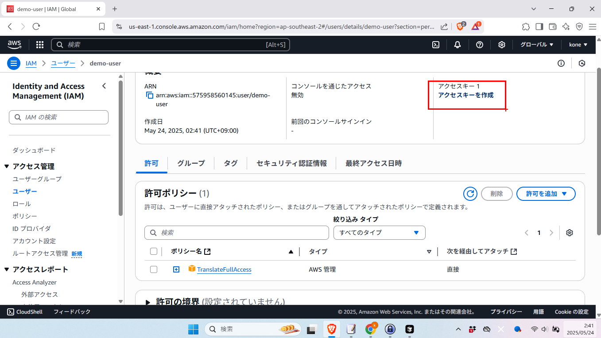

# AWS初心者向けチュートリアル：Amazon TranslateとPollyを使ってみよう

## はじめに

### 対象読者
- Google Cloud Platform（GCP）の経験はあるが、AWSは初めての方
- Python歴3ヶ月程度の事務職の方
- 職業エンジニアではないが、API連携などの自動化に興味がある方

### このチュートリアルで学べること
1. AWSアカウントの作成方法
2. AWSコンソールへのログイン方法
3. IAM（Identity and Access Management）でのユーザ作成方法
4. IAM ユーザへのポリシーの適用方法
5. ユーザに紐づいたアクセスキーペアの作成方法
6. IAM ユーザへのポリシーの追加適用方法

### 必要なもの
- インターネット接続可能なPC
- Pythonがインストールされた環境
- クレジットカード（AWS無料利用枠内で使用予定ですが、アカウント作成時に必要）

---

## 1. AWSアカウントの作成

### 1.1 アカウント登録の開始

まず、AWSの公式サイト（https://aws.amazon.com/）にアクセスします。

上記の画面のように、「無料でアカウント作成」または「今すぐ無料アカウントを作成」ボタンが表示されています。このボタンをクリックしてアカウント作成を開始します。

### 1.2 アカウント情報の入力

最初のアカウント作成画面では、以下の基本情報を入力します：
- **Eメールアドレス**: ログイン時に使用するメールアドレス
- **AWSアカウント名**: 管理しやすい任意の名前

「Eメールアドレスを確認」ボタンを押すと検証コードを含むメールが来ます。  
その値を次の画面で記入してください。

### 1.3. ルートユーザパスワードの設定

ルートユーザパスワードを設定します。

### 1.4 連絡先情報の入力

続いて、連絡先情報を入力します：
- **連絡先の種類**: 個人または法人を選択（今回は「個人」を選択）
- **氏名**: フルネームを入力
- **住所**: 正確な住所を入力（郵便番号、都道府県、市区町村、番地）
- **電話番号**: 本人確認で使用される番号

### 1.5 支払い情報の設定

支払い方法の設定画面では、クレジットカード情報を入力します。

入力する情報：
- **カード番号**: 16桁のクレジットカード番号
- **有効期限**: MM/YY形式
- **カード名義**: カードに記載されている名前
- **請求先住所**: カード登録住所と同じ場合はチェックボックスを選択可能

**注意**: 今回のチュートリアルは無料利用枠内で実行できる内容ですが、アカウント作成には支払い方法の登録が必要です。

### 1.6 本人確認

電話番号による本人確認を行います。  
SMSまたは本人へのコールで認証れれます。

)

上記の画面が表示されたら、指定した方法で通知が来ます。

### 1.7 サポートプランの選択

サポートプランは無料の「ベーシック」でかまいません。

---

## 2. AWSコンソールへのログイン

### 2.1 初回ログイン

本人確認が完了すると、AWSマネジメントコンソールにアクセスできるようになります。

「AWSマネジメントコンソールにお進みください」をクリック。

### 2.2 すべてのサービスを見てみる

  

AWS には様々なサービスがあります。

### 2.3 IAM でユーザを作る

左上の検索ダイアログに `IAM` と入力して IAM メニューを見つけます。

左メニューで「ユーザ」を見つけてクリック。  
右の画面で「ユーザを作成」をクリック。

ユーザの詳細画面でユーザ名を設定しましょう。

### 2.4 IAM で作ったユーザに permission を割り当てる

AWS Translation を使うために、今作った IAM ユーザに「TranslateFullAccess」の権限を割り当てます。

「グループに権限を割り当ててそのグループに参加させる」という方法もありますが、グループを作ってないので今回はユーザに直接権限を付与します。

「許可ポリシー」の検索窓に `TranslateFullAccess` と入力します。  
見つかった `TranslateFullAccess` を選択し、「次へ」ボタンを押します。

権限が付与されたことを確認します。

## 3. ユーザのアクセスキーペアを作る

## 3.1 ユーザのアクセスキーペアを作ります

ユーザリストを表示し、さきほど作った `demo-user` を見つけてクリック。

アクセスキー作成ボタンを押します。

最後の選択肢を選択します。

アクセスキーの詳細を記述します。

アクセスキーとシークレットアクセスキーのペアを取得できます。  
`.env` ファイルにはこれら値を使用します。

さっそく、 `aws01_translate_text.py` で動作確認をしてみてください。

## 4. IAMユーザの権限を追加する

Polly を使うための権限をさらに追加してみよう。

ユーザ画面右の「ポリシーを追加」ボタンをクリック。

あとは Translate の権限を追加したときと同様。  
検索から `AmazonPollyFullAccess` を見つけてくる。

追加する権限の確認画面。

最終的に2つの権限を有する状態になった
